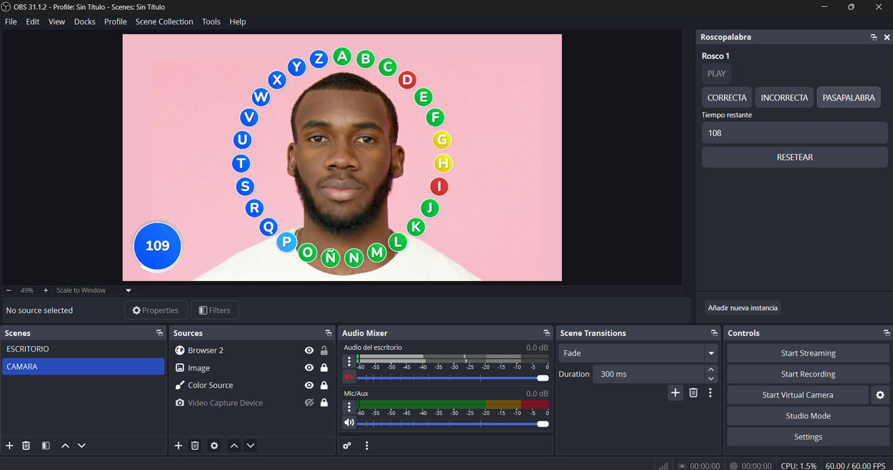

## Overlay Roscopalabra para OBS con controles

## Como instalar:

- Añadir nueva fuente de **Navegador** en OBS
- Ingresar esta URL: `###`
- Configurar Ancho y Alto al tamaño de tu escena
- Ir a Docks -> Custom Browser Docks
- Asignar un nombre al Dock e ingresar en URL: `###/controls.html`
- Ajustar el tamaño de la fuente a tu escena y ya esta listo para usar

### Como agregar una segunda instancia:

Si tienes dos o más jugadores puede añadir una instancia independiente de esta manera:

- Añade una nueva fuente de **Navegador** que será la segunda instancia de tu roscapalabra, con la misma url, pero añade al final `?instance=cualquier_nombre`
- Luego en el dock de roscapalabra haz clic en **Añadir nueva instancia**, y pon el mismo nombre que asignaste cuando añadiste la nueva fuente.
- Ya tendrás los dos controles independientes para tus fuentes.
